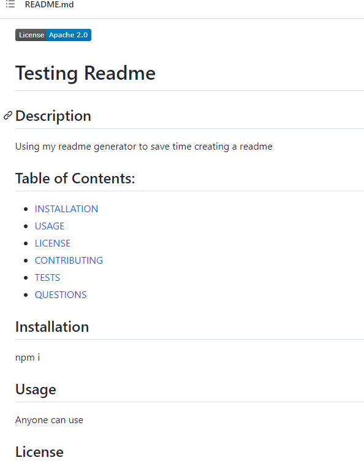

  
  # README Generator

  ## Description
  Creating a quality README generator that can be used for future projects. Being able to create a README in seconds will save time!

  ## Table of Contents:
  * [INSTALLATION](#installation)  
  * [DEMO](#demo)  
  * [USAGE](#usage)
  * [LICENSE](#license)  
  * [CONTRIBUTING](#contributing) 
  * [TESTS](#tests)  
  * [QUESTIONS](#questions)  

  ## Installation

  To install run npm install
  Then run node index.js

  ## Demo

https://user-images.githubusercontent.com/96558916/153504273-8dd070bb-61b0-40ef-8c2a-0e512293044f.mp4

  

  ## Usage

  An application to generate a README for any repository quickly to save time.

  ## License

    
  [Apache 2.0 License](https://opensource.org/licenses/Apache-2.0)  
  Apache License
      Version 2.0, January 2004

  ## Contributing

  Mpalfano

  ## Tests

  npm test

  ## Questions
  
  Contact me at:

  https://github.com/mpalfano/  

  mpalfano4@gmail.com

